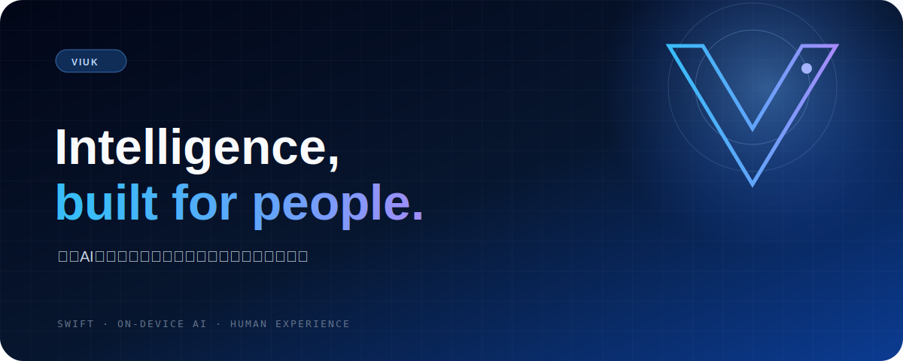
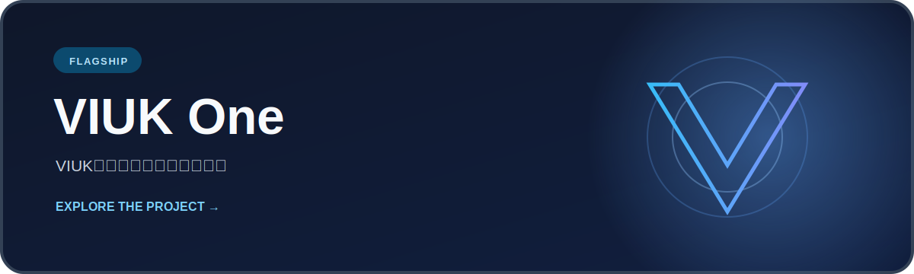

  

  <strong>人とAIが、もっと自然につながる未来をつくる。</strong>

  <a href="https://github.com/VIUK-Light/VIUK-one">VIUK One</a>
  ·
  <a href="https://huggingface.co/Shirokuma-VIUK">Hugging Face</a>
  ·
  <a href="https://qiita.com/viuk">Qiita</a>
  ·
  <a href="https://zenn.dev/viuk_sirokuma">Zenn</a>

 

## What we build

 

## Why VIUK

見えにくい課題に光を当て、テクノロジーを人のための体験へ変えていく。  
私たちはSwift、オンデバイスAI、そして新しいプロダクト体験を通して、  
小さな実験から明るい未来をつくります。

| Illuminate | Human first | Build in public |
|:--|:--|:--|
| 見過ごされてきた課題を見つける | 技術ではなく、人の体験から考える | 作り、学び、成果をひらく |

 

## Open exploration

モデルや機械学習の実験は[Hugging Face](https://huggingface.co/Shirokuma-VIUK)で公開しています。  
VIUK-Lightのプロジェクト、実験、学びは、ここGitHubから広がっていきます。

  Light the unseen. Build a brighter future.

