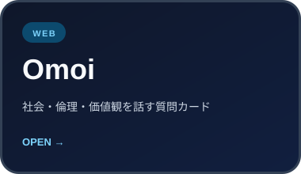
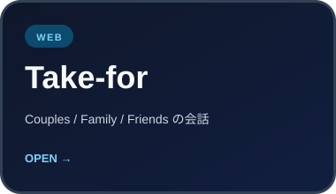
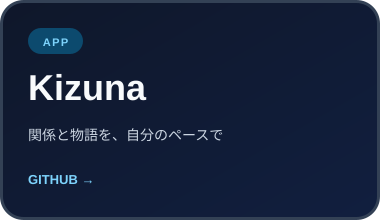

  
  

  人が自分で考え、選び、前へ進むためのオープンソース。 
  <a href="https://viuk-light.org/">viuk-light.org</a>

<table>
  <tr>
    <td width="33%">
      
    </td>
    <td width="33%">
      
    </td>
    <td width="33%">
      
    </td>
  </tr>
</table>
